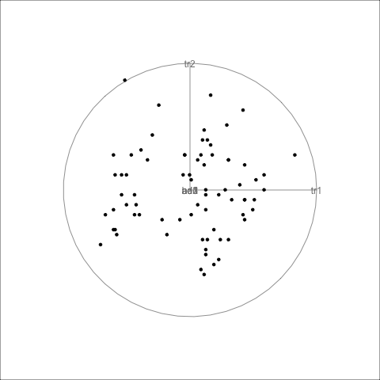

```{r setup, include=FALSE}
library(knitr)
library(tourr)
library(detourr)
options("knitr.graphics.auto_pdf" = TRUE)
knitr::opts_chunk$set(
  echo = FALSE, warning = FALSE, message = FALSE,
  out.width = ifelse(is_html_output(), "100%", "\\textwidth")
)
```

# Introduction

Multivariate data often contains interesting features that we would like to uncover when performing exploratory data analysis. These features include clusters of points, outliers, linear dependiencies, non-linear relationships, and low-dimensional substructures, and can often remain hidden when using static visualizations such as histograms and scatterplot matrices [@tours]. 

A common method for exploring multivariate data is the tour, where we take a sequence of $d < p$-dimensional projections of our data and interpolate between them to create an animation. These animations allow us to view the data from many different angles, and helps us to uncover the features mentioned above.  

The \CRANpkg{tourr} package in R produces tours of multivariate data. The animations produced by \CRANpkg{tourr} can be viewed using the R graphics device, passed to [\pkg{GGobi}](https://github.com/ggobi), or saved to disk [@tourr2011].

This paper introduces the \pkg{detourr} package, which extends \CRANpkg{tourr} with interactive web-based visualisations using \CRANpkg{HTMLWidgets}. We begin with a brief review of the \CRANpkg{tourr} package, and how we've built upon it. We will then include a series of examples to showcase the functionality of \pkg{detourr}, including interactive features like brushing, selection, tooltips, and timeline controls. 
We will also cover integration with the \CRANpkg{crosstalk} for linking different visuals, performance considerations, and lastly the project structure and how to contribute.

# Background: {tourr}

The \CRANpkg{tourr} package in R is designed to be extensible and is intended to provide a testbed for tour research [@tourr2011]. One way this extensibility is achieved is by separating out the tour generators (e.g. `grand_tour`, `little_tour`) from the display methods (e.g. `display_xy`, `display_depth`). 

For example, the following code produces a 2-d tour which is displayed as a scatter plot using the R Graphics device:

```{r, eval=FALSE, echo=TRUE}
animate(flea[, 1:6],
  grand_tour(d = 2),
  display = display_xy()
)
```

A similar animation can be rendered as a GIF like in the following code:

```{r, echo=TRUE, eval = knitr::is_html_output(), results="hide"}
render_gif(
  flea[, 1:6],
  grand_tour(d = 2),
  display_xy(),
  "img/flea.gif"
)
```

```{r flea-tourr, fig.cap = "A grand tourr of the flea data rendered as an x-y scatterplot."}
if (knitr::is_latex_output()) {
  render(flea[, 1:6], grand_tour(d = 2),
    display_xy(),
    frames = 1, dev = "png",
    filename = "img/flea.png"
  )
  
} else {
  
}
```

In general, the call used in \CRANpkg{tourr} has the form [@tourr2011]:

```{r, eval=FALSE, echo=TRUE}
tour_function(data, tour_path, display_method)
```

# {detourr}

The \pkg{detourr} package extends \CRANpkg{tourr} and has a similar structure, but with a few important differences:

- Only one tour function is currently supported: `animate_tour`
- \pkg{detourr} has it's own display method (`display_scatter`) which are not compatible with \CRANpkg{tourr}. More display methods will be available in future. 
- Input data must be provided as a data frame, not a matrix.

```{r, echo=TRUE, eval = knitr::is_html_output()}
animate_tour(
  flea,
  grand_tour(2),
  display_scatter(tour_aes(colour = species))
)
```

# Interactivity

Brushing, selection, hovering / labels

# Crosstalk Integration

Javascript JIT / matrix multiplication

drawing: HTML Canvas vs SVG

sleep

# Performance Considerations

Javascript JIT / matrix multiplication

drawing: HTML Canvas vs SVG

sleep

# Summary

We have displayed various tooltips that are available in the package \pkg{ToOoOlTiPs}. 

```{r pkg-bib, eval = FALSE}
pkgs <- c(
  "htmlwidgets", "plotly",
  "crosstalk", "tourr"
)
write_bib(pkgs, "rpkgs.bib")
```
