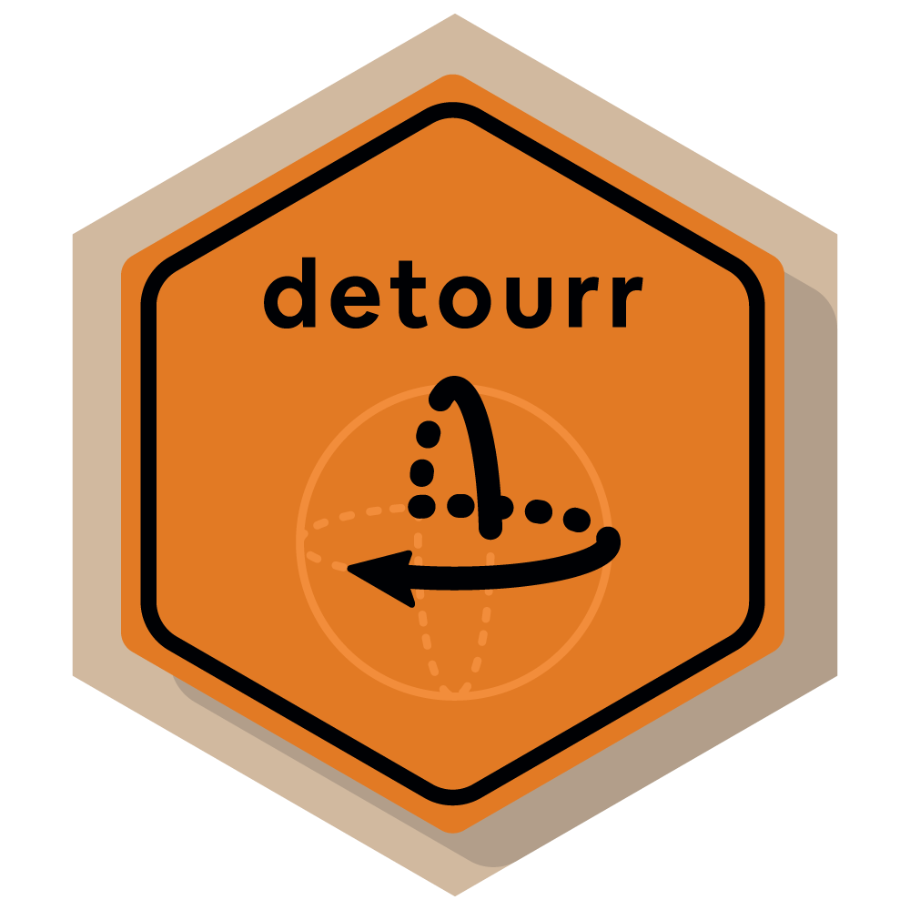
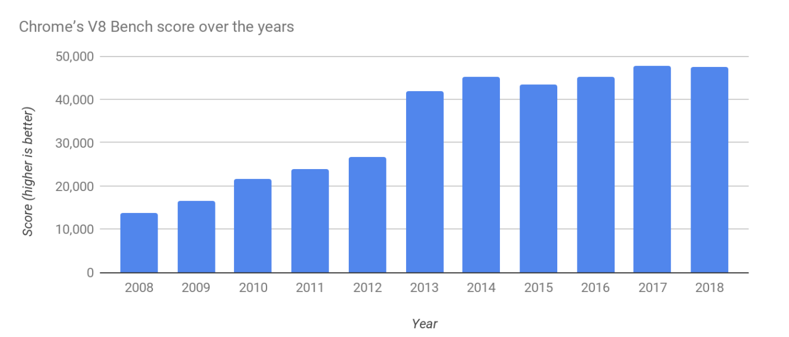

# Tours in R

The `{tourr}` package has a comprehensive set of tour path generators and display methods, with some limitations:

- Portability
- Interactivity
- Performance
- Extensibility

To address these limitations, we take a _detour_ in to web technologies...

---

#  ... and we want to avoid this

```{r, echo=FALSE, message=FALSE, warning=FALSE}
knitr::opts_chunk$set(comment = "#>", out.width = "100%")

library(tourr)
library(detourr)
suppressPackageStartupMessages(library(tidyverse))
```

```{r, echo = FALSE}
knitr::include_graphics("tour_html.gif")
```

---

.center[

  .bigBlock[
    AHEAD
  ]
  .bigBlock[
    FOLLOW  
     
     @casperhart
  ]
]
---

# Introducing `{detourr}`

```{r, echo=FALSE, message=FALSE}
library(detourr)
detour(
  olive,
  tour_aes(projection = palmitic:eicosenoic, colour = region)
) |>
  show_scatter(alpha = 0.5)
```

---

# Portability

`{detourr}` visuals are written in TypeScript / JavaScript, using `{HTMLWidgets}` to work with R. It runs well with:

- Any browser
- The RStudio viewer
- VScode webview
- Knitr (with html output)
- Shiny
- `{xaringan}` slides

---

# Interactivity

.pull-left[
  .big[
- Orbit Controls
- Selection and Brushing
- Timeline
- Labels
  ]
]


.pull-right[
```{r, echo=FALSE, message=FALSE, fig.align="right"}
library(detourr)
detour(
  olive,
  tour_aes(projection = palmitic:eicosenoic, colour = region, label = c(region, area))
) |>
  tour_path(grand_tour(3)) |>
  show_scatter(alpha = 0.5)
```
]

---

# Linked selection with `{crosstalk}`

```{r, echo=FALSE}
library(detourr)
library(crosstalk)
library(d3scatter)

olive <- mutate(olive, region = as.character(region))

shared_olive <- SharedData$new(olive)

a <- d3scatter(shared_olive,
  x = ~palmitic, y = ~oleic, color = ~region,
  width = "100%"
)
b <- detour(
  shared_olive, tour_aes(projection = palmitic:eicosenoic, colour = region)
) |>
  show_scatter(width = "100%")

bscols(
  a,
  b
)
```

---

# Linked selection with `{crosstalk}`

Compatible with:

- `plotly/plotly.R`
- `rstudio/leaflet`
- `rstudio/DT`

---

# User API

{detourr} has a declarative API for building a tour visual. Instantiate a `detour` object with `detour()`:

```{r, eval=FALSE}
remotes::install_github("casperhart/detour@v0.0.2")
```

```{r}
detour( #<<
  olive,
  tour_aes(projection = palmitic:eicosenoic, colour = region)
)
```

---

# User API: tour path

```{r}
detour(
  olive,
  tour_aes(projection = palmitic:eicosenoic, colour = region)
) |> tour_path(grand_tour(3)) #<<
```

---

# User API: display methods

```{r}
detour(
  olive,
  tour_aes(projection = palmitic:eicosenoic, colour = region)
) |>
  tour_path(grand_tour(3)) |>
  show_scatter(height = "50%") #<<
```

---

# Displays: `show_scatter()`

```{r, echo=FALSE}
detour(
  olive,
  tour_aes(
    projection = palmitic:eicosenoic,
    colour = region,
    label = c(region, area)
  )
) |>
  tour_path(grand_tour(3)) |>
  show_scatter()
```

---

# Displays: `show_sage()`

```{r, echo=FALSE}
library(detourr)
library(dplyr)
data(pdfsense, package = "liminal")

pcs <- pdfsense |>
  select(X1:X56) |>
  prcomp()

pcs <- as_tibble(pcs$x) |>
  select(PC1:PC6)

plot_data <- pdfsense |>
  select(-(X1:X56)) |>
  mutate(Type = as.character(Type)) |>
  bind_cols(pcs)

detour(
  plot_data,
  tour_aes(
    projection = starts_with("PC"),
    colour = Type, label = I(ID)
  )
) |>
  tour_path(max_bases = 5) |>
  show_sage(alpha = 0.5, gamma = 56 / 6)
```

---

# Displays: `show_slice()`

```{r, echo=FALSE, message=FALSE}
x <- geozoo::roman.surface(n = 10000)$points |>
  as_tibble(.name_repair = "unique")

detour(x, tour_aes(projection = everything())) |>
  tour_path(grand_tour(2), max_bases = 10) |>
  show_slice(slice_relative_volume = 0.1)
```

---

# Performance: scripting

Javascript is... pretty quick!



---

# Performance: matrix operations

Vanilla JavaScript is not ideal for matrix operations... 
--
but **TensorFlow.js** is.

--

Backend options:
- CPU

--
- WebAssembly (WASM)

--
- WASM + SIMD

--
- WASM + SIMD + threads

--
- WebGL / GPU Acceleration?

---

# Performance: rendering

.pull-left[
- 1x SVG 
- 10x HTML5 Canvas + 2D
- 100x HTML5 Canvas + WebGL

WebGL rendering is used for `scatter`, `slice`, and `sage` displays via `Three.JS`

New displays can use any of these.
]


.pull-right[


]

---

# Extensibility

- Written in TypeScript

--
- Existing widgets can be extended through inheritance

--
- Controls and timeline are reusable

--
- `webpack-dev-server` for hot reloading during development

--
- Independent widgets for each display method. 

--
- Tour paths compatible with `{tourr}`


---

.center2[

]