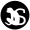

# Tours in R

The {tourr} package has a comprehensive set of tour path generators and display methods, with some limitations:

- Portability
- Interactivity
- Performance
- Extensibility

We want to address these limitations...

---

#  ... and we want to avoid this

```{r, echo=FALSE, message=FALSE, warning=FALSE}
knitr::opts_chunk$set(comment = "#>", out.width = "100%")

library(tourr)
suppressPackageStartupMessages(library(tidyverse))
X <- geozoo::cube.face()$points
```

```{r, echo = FALSE}
knitr::include_graphics("tour_html.gif")
```

---

# Introducing {detourr}

```{r, echo=FALSE, message=FALSE}
library(detourr)
p <- detour(
  olive,
  tour_aes(projection = palmitic:eicosenoic, colour = region)
) |>
  show_scatter(alpha = 0.5)
p
```

---

# Portability

{detourr} visuals are written in TypeScript / JavaScript, using {HTMLWidgets} to work with R. It runs well with:

- Any browser
- The RStudio viewer
- VScode webview
- Knitr (with html output)
- Shiny
- {xarignan} slides

---

# Interactivity - orbit controls

```{r, echo=FALSE, message=FALSE}
library(detourr)
p <- detour(
  olive,
  tour_aes(projection = palmitic:eicosenoic, colour = region, label = c(region, area))
) |>
  tour_path(grand_tour(3)) |>
  show_scatter(alpha = 0.5)
p
```

---

# Interactivity - selection and brushing

```{r, echo=FALSE}
p
```

---

# Linked selection with {crosstalk}

```{r, echo=FALSE}
library(detourr)
library(crosstalk)
library(d3scatter)

olive <- mutate(olive, region = as.character(region))

shared_olive <- SharedData$new(olive)

a <- d3scatter(shared_olive,
  x = ~palmitic, y = ~oleic, color = ~region,
  width = "100%"
)
b <- detour(
  shared_olive, tour_aes(projection = palmitic:eicosenoic, colour = region)
) |>
  show_scatter(width = "100%")

bscols(
  a,
  b
)
```

---

# Interactivity - timeline

```{r, echo=FALSE}
p
```

---

# Performance 

.pull-left[
## Scripting

- Modern Javascript JIT compilation
- Tensorflow.js for linear algebra (WebAssembly backend coming soon)

## Rendering

- Three.js / WebGL for GPU-accelerated rendering

]


.pull-right[





]

---

# User API

{detour} has a declarative API for building a tour visual. Under the hood the `detour` object is stored as a `tibble`:

```{r}
# remotes::install_github("casper-hart/detour@v0.0.2")
```

```{r}
detour(
  olive,
  tour_aes(projection = palmitic:eicosenoic, colour = region)
)
```

---

# User API

```{r}
detour(
  olive,
  tour_aes(projection = palmitic:eicosenoic, colour = region)
) |> tour_path(grand_tour(3))
```

---

# User API

```{r}
p <- detour(
  olive,
  tour_aes(projection = palmitic:eicosenoic, colour = region)
) |>
  tour_path(grand_tour(3)) |>
  show_scatter()

class(p)
```

---

# Displays - `show_scatter()`

```{r, echo=FALSE}
detour(
  olive,
  tour_aes(
    projection = palmitic:eicosenoic,
    colour = region,
    label = c(region, area)
  )
) |>
  tour_path(grand_tour(3)) |>
  show_scatter()
```

---

# Displays - `show_sage()`

```{r, echo=FALSE}
library(detourr)
library(dplyr)
data(pdfsense, package = "liminal")

pcs <- pdfsense |>
  select(X1:X56) |>
  prcomp()

pcs <- as_tibble(pcs$x) |>
  select(PC1:PC6)

plot_data <- pdfsense |>
  select(-(X1:X56)) |>
  mutate(Type = as.character(Type)) |>
  bind_cols(pcs)

detour(
  plot_data,
  tour_aes(
    projection = starts_with("PC"),
    colour = Type, label = I(ID)
  )
) |>
  tour_path(max_bases = 5) |>
  show_sage(alpha = 0.5, gamma = 56 / 6)
```

---

# Displays - `show_slice()`

```{r, echo=FALSE, message=FALSE}
x <- geozoo::roman.surface(n = 10000)$points |>
  as_tibble(.name_repair = "unique")

detour(x, tour_aes(projection = everything())) |>
  tour_path(grand_tour(2), max_bases = 10) |>
  show_slice(slice_relative_volume = 0.1)
```

---

# Extensibility