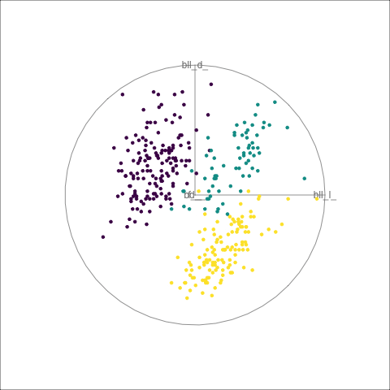
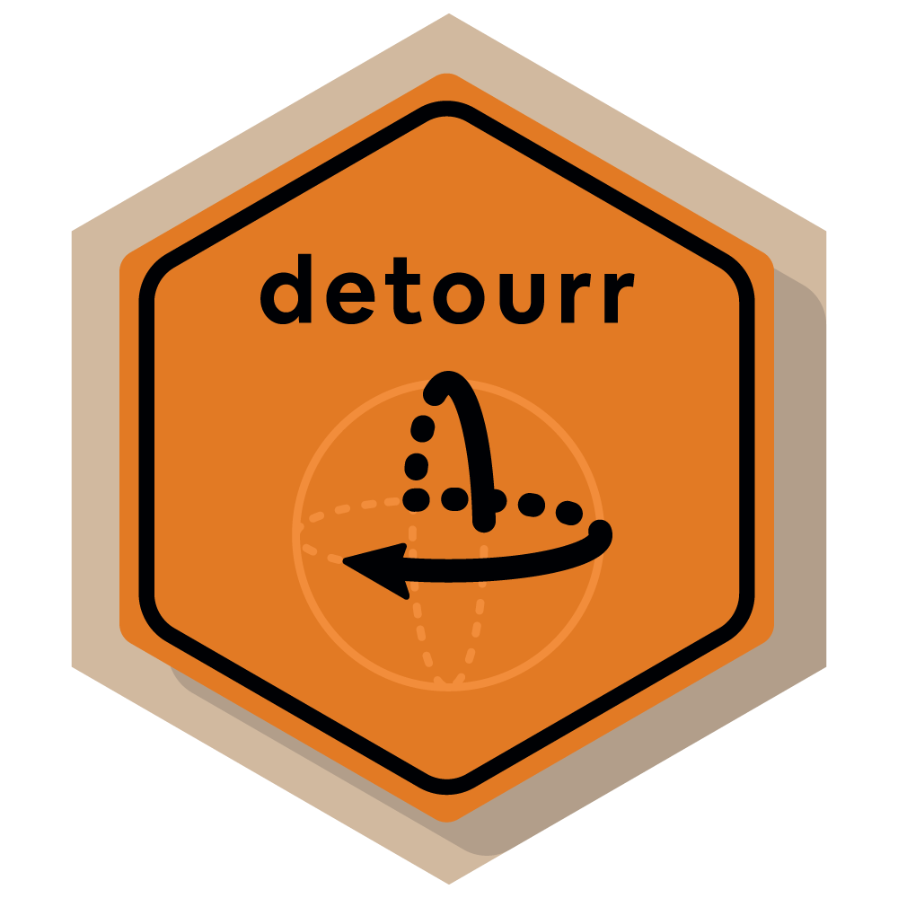
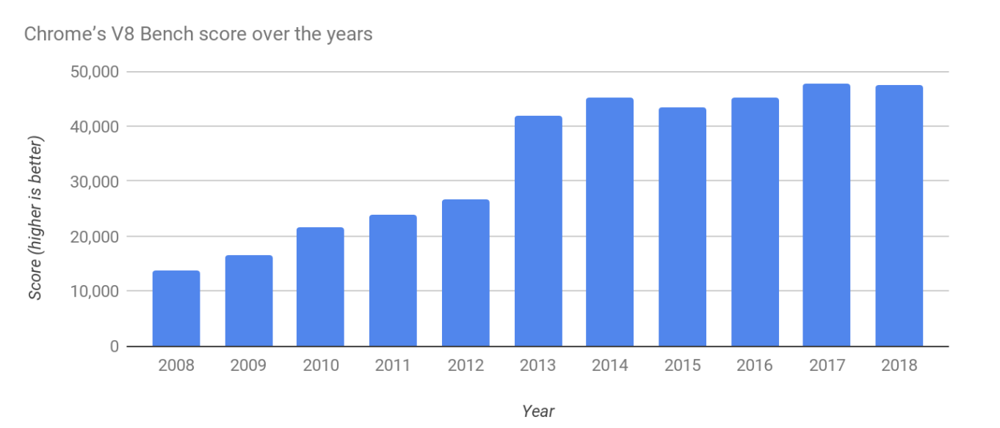
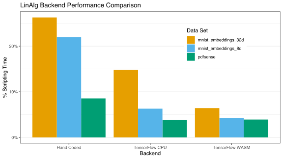
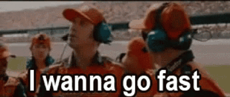

<link href='//fonts.googleapis.com/css?family=Montserrat:thin,extra-light,light,100,200,300,400,500,600,700,800' 
rel='stylesheet' type='text/css'>

```{r xaringan-themer, include=FALSE, warning=FALSE}
library(xaringanthemer)
library(tidyverse)
library(RefManageR)

pal <- unname(palette.colors())[-1]

options(
  knitr.graphics.auto_pdf = TRUE,
  tibble.print_min = 5,
  ggplot2.discrete.fill = pal,
  ggplot2.discrete.colour = pal
)
style_mono_accent(
  base_color = "#1c5253",
  header_font_google = google_font("Josefin Sans"),
  text_font_google = google_font("Montserrat", "300", "300i"),
  code_font_google = google_font("Fira Mono")
)

knitr::opts_chunk$set(comment = "#>", out.width = "100%")
library(tourr)
library(detourr)
library(palmerpenguins)

suppressPackageStartupMessages(library(tidyverse))

penguins <- penguins |>
  drop_na(species, bill_length_mm:body_mass_g) |>
  mutate_at(vars(bill_length_mm:body_mass_g), scale)
```

```{r xaringan-panelset, echo=FALSE}
xaringanExtra::use_panelset()
```

# Background on tours

--

A tour is sequence of projections of data displayed as an animation

--

1. Choose a sequence of projections and interpolate between them; The **tour path** $\mathbf{A}_1 \dots \mathbf{A}_t$

--

2. Display the projected data $\mathbf{Y}_i = \mathbf{XA}_i$ as an animation; The **display method**

--

Example **{tourr}**:

```{r, echo=FALSE, eval=FALSE}
library(tourr)
library(palmerpenguins)
render_gif(penguins[, 3:6], grand_tour(2), display_xy(col = penguins$species), "penguins.gif")
```

<div width="100%" style="display: flex; justify-content: center">
   
</div>
---

class: center, inverse, middle, title-slide

# Motivation

---

#  Interactivity 😕

<div width="100%" style="display: flex; justify-content: center">
   
</div>

---

#  Performance ☹️

```{r, eval=FALSE, echo=FALSE}
library(detourr)
library(tourr)
library(tidyverse)
mnist_embeddings_8d |>
  select(starts_with("X")) |>
  animate(col = mnist_embeddings_8d$label, display = display_xy(col = mnist_embeddings_8d$label), fps = 30)
```


<div width="100%" style="display: flex; justify-content: center">
  
</div>

---

#  Portability... 😭

```{r, echo = FALSE}
knitr::include_graphics("tour_html.gif")
```

---

class: center, middle, inverse, title-slide

#  How do we get around these limitations? 
# 🚧 🤔 🚧

---

class: center, middle


  .strong[
    AHEAD
  ]
  .strong[
    FOLLOW  
     
     @casperhart
  ]
---

# Introducing `{detourr}`

```{r, echo=FALSE, message=FALSE}
library(detourr)
set.seed(1)
detour(
  penguins,
  tour_aes(projection = bill_length_mm:body_mass_g, colour = species)
) |>
  show_scatter(paused = FALSE)
```

---

# Interactivity 😮

.pull-left[
  .big[
- Orbit Controls
- Selection and Brushing
- Timeline
- Labels
  ]
]


.pull-right[
```{r, echo=FALSE, message=FALSE, fig.align="right"}
library(detourr)
p <- detour(
  penguins,
  tour_aes(
    projection = bill_length_mm:body_mass_g, colour = species,
    label = c(species, island, sex, year)
  )
) |>
  tour_path(grand_tour(3)) |>
  show_scatter()
p
```
]

---

# Portability 🙃

`{detourr}` visuals are written in TypeScript / JavaScript, using `{HTMLWidgets}` to work with R. It runs well with:

- Any browser 
- RStudio
- VScode
- Knitr (with html output)
- Shiny
- `{xaringan}` slides

---

# Performance 😁

```{r, echo=FALSE}
detour(
  mnist_embeddings_8d,
  tour_aes(
    projection = starts_with("X"),
    colour = label,
    label = c(label, id)
  )
) |>
  tour_path(grand_tour(3)) |>
  show_scatter()
```

---

# Linked selection with `{crosstalk}` 😮

```{r, echo=FALSE, warning=FALSE, message=FALSE}
library(detourr)
library(crosstalk)
library(plotly)

cols <- viridisLite::viridis(3)[penguins$species]

shared_penguins <- SharedData$new(penguins)

a <- plot_ly(shared_penguins,
  x = ~bill_depth_mm, y = ~bill_length_mm,
  width = "100%",
  color = ~species,
  colors = viridisLite::viridis(3)
) %>%
  add_markers() %>%
  highlight(on = "plotly_selected", dynamic = TRUE)

b <- detour(
  shared_penguins, tour_aes(projection = bill_length_mm:body_mass_g, colour = species)
) |>
  show_scatter(width = "100%", height = "450px")

bscols(
  a,
  b
)
```

---

# Linked selection with `{crosstalk}` 😮 

Compatible with:

- `plotly/plotly.R`
- `rstudio/leaflet`
- `rstudio/DT`
- `glin/reactable`
- `jbkunst/highcharter`

---

class: center, inverse, middle, title-slide

# User API 
# 👩‍💻

---

# Data and aesthetics 👩‍💻

`{detourr}` has a declarative API for building a tour visual. Instantiate a `detour` object with `detour()`:

.panelset[
.panel[.panel-name[R Code]

```{r, eval=FALSE}
install.packages("detourr") # -or-
remotes::install_github("casperhart/detourr")
```

```{r, eval=FALSE}
detour( #<<
  penguins,
  tour_aes(projection = bill_length_mm:body_mass_g, colour = species)
)
```

]

.panel[.panel-name[Output]

```{r, echo=FALSE}
detour( #<<
  penguins,
  tour_aes(projection = bill_length_mm:body_mass_g, colour = species)
)
```

]
]

---

# Tour path 🚴‍♀️

.panelset[
.panel[.panel-name[R Code]

```{r, eval=FALSE}
detour(
  penguins,
  tour_aes(projection = bill_length_mm:body_mass_g, colour = species)
) |> tour_path(grand_tour(3)) #<<
```
]

.panel[.panel-name[Output]

```{r, echo=FALSE}
detour(
  penguins,
  tour_aes(projection = bill_length_mm:body_mass_g, colour = species)
) |> tour_path(grand_tour(3)) #<<
```

]
]

---

# Display 📺

.panelset[
.panel[.panel-name[R Code]

```{r, eval=FALSE}
detour(
  penguins,
  tour_aes(projection = bill_length_mm:body_mass_g, colour = species)
) |>
  tour_path(grand_tour(3)) |>
  show_scatter() #<<
```
]

.panel[.panel-name[Output]

```{r, echo=FALSE}
detour(
  penguins,
  tour_aes(projection = bill_length_mm:body_mass_g, colour = species)
) |>
  tour_path(grand_tour(3)) |>
  show_scatter(height = "450px")
```

]
]

---

class: center, middle

# data |> tour path |> display method

---

class: center, middle

# detour() |> tour\_path() |> show\_*()

---

class: center, inverse, middle, title-slide

# Display methods 📺

---

# `show_scatter()` 📺

```{r, echo=FALSE, message=FALSE}
x <- geozoo::cube.solid.grid(4, 1)

x$points |>
  as_tibble(.name_repair = "unique") |>
  detour(tour_aes(projection = everything())) |>
  tour_path(grand_tour(2)) |>
  show_scatter(edges = x$edges, axes = FALSE)
```

---

# `show_scatter()` ✨

```{r, echo=FALSE}
detour(
  mnist_embeddings_8d,
  tour_aes(
    projection = starts_with("X"),
    colour = label,
    label = c(label, id)
  )
) |>
  tour_path(grand_tour(3)) |>
  show_scatter()
```

---

# `show_sage()` 🌱

```{r, echo=FALSE}
detour(
  mnist_embeddings_8d,
  tour_aes(
    projection = starts_with("X"),
    colour = label,
    label = c(label, id)
  )
) |>
  tour_path(grand_tour(2)) |>
  show_sage()
```

---

# `show_slice()` 🍰

```{r, echo=FALSE, message=FALSE}
x <- geozoo::roman.surface(n = 10000)$points |>
  as_tibble(.name_repair = "unique")

detour(x, tour_aes(projection = everything())) |>
  tour_path(grand_tour(2), max_bases = 10) |>
  show_slice(slice_relative_volume = 0.1)
```

---

# `show_slice()` 🍰

```{r, echo=FALSE, message=FALSE}
detour(
  mnist_embeddings_8d,
  tour_aes(
    projection = starts_with("X"),
    colour = label,
    label = c(label, id)
  )
) |>
  tour_path(grand_tour(2)) |>
  show_slice()
```

---

# `show_slice()` 🍰

```{r, echo=FALSE, message=FALSE}
detour(
  mnist_embeddings_8d,
  tour_aes(
    projection = starts_with("X"),
    colour = label,
    label = c(label, id)
  )
) |>
  tour_path(grand_tour(3)) |>
  show_slice()
```

---

class: center, inverse, middle, title-slide

# Performance
# 🚗

---

# Scripting 🚗

Javascript is... pretty quick!



---

# Matrix operations 🚗

**{detourr}** uses **TensorFlow.js** with the **Webassembly** backend for linear algebra operations. This uses the Google XNNPACK library, leveraging **SIMD** and **Threads**.

```{r, message=FALSE, echo=FALSE, warning=FALSE}
benchmarks <- read_tsv("backend_benchmarks.tsv")
svg("perf-comparison.svg", width = 8, height = 4.5)
ggplot(benchmarks, aes(x = Backend, y = `Percent Time`, fill = `Data Set`)) +
  geom_col(position = "dodge") +
  theme_bw() +
  scale_y_continuous(labels = scales::label_number(suffix = "%")) +
  theme(
    legend.position = c(0.75, 0.75),
    panel.grid.major.x = element_blank(),
    panel.grid.minor.x = element_blank()
  ) +
  labs(
    title = "LinAlg Backend Performance Comparison",
    y = "% Scripting Time"
  )
invisible(dev.off())
```




---

# Rendering 🚗

.pull-left[
- 🐢 SVG is good at rendering **large** objects, but is slow when rendering **many** objects.

Alternative:

- 🚗 HTML5 Canvas + **WebGL** (GPU)

Implemented with **Three.js**

]

.pull-right[



]

---

# Contributions welcome   

--

#### More visuals!

--
- density plot
- histogram 
- Andrew's plot 
- PCP

--

#### More features!

--

- facetting 
- legends
- point symbols
- antialiasing

--

#### More performance!

---

# Emojis required 

<div width="100%" style="display: flex; justify-content: center">


</div>

---

**Sage display**: 

Laa, Ursula, Dianne Cook, and Stuart Lee. 2021. “Burning Sage: Reversing the Curse of Dimensionality in the Visualization of High-Dimensional Data.”Journal of Computational and Graphical Statistics, 1–10.

**Slice display**:

Laa, Ursula, Dianne Cook, and German Valencia. 2020. “A Slice Tour for Finding Hollowness in High-Dimensional Data.”Journal of Computational and Graphical Statistics 29 (3): 681–87.

**{tourr}**:

Wickham, Hadley, Dianne Cook, Heike Hofmann, and Andreas Buja. 2011. “Tourr: An r Package for Exploring Multivariate Data with Projections.”Journal of Statistical Software 40: 1–18.

---

class: center, middle

#### Slides:

## github.com/casperhart/paper-detourr

#### Package website:

## casperhart.github.io/detourr

 
 @casperhart
